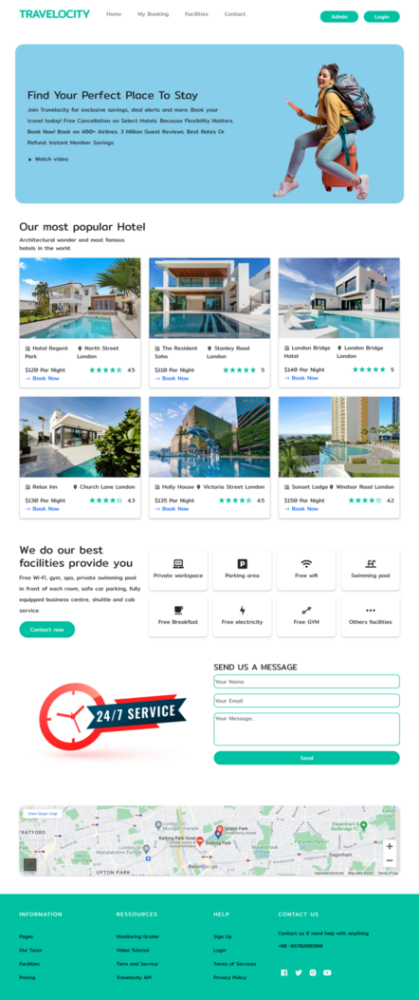

# Travelocity

#### Travelocity is  A full-stack booking service provider web application project with firebase authentication. where any person can book a hotel, and an Admin can view the booking lists and add hotels and manage the whole system.

---

## Features

* A full-stack booking service provider web application project with firebase authentication.
* A person can register in any event and view the events they already registered.
* A person can log in through Gmail or Facebook.
* Admin can view all the booking , add new hotel and manage the whole system.

## Technology used

### Frontend

* React
* Bootstrap-5
* React-Bootstrap
* React-Router(version 6.4.4)
* Deploy-Firebase

### Backend

* Node.js
* Express.js
* Database-MongoDB
* Deploy-Railway
